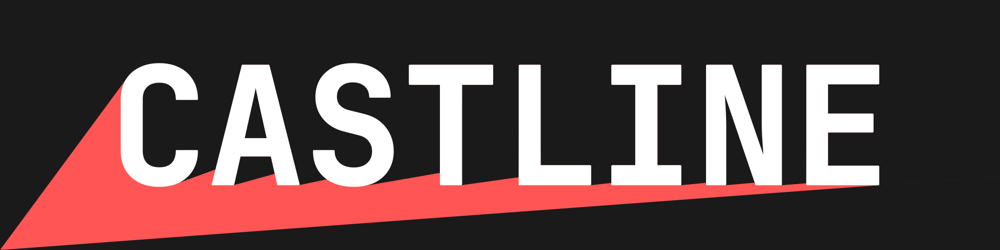

# Castline



**Castline** is a minimalist 2.5D raycasting game built in C++ using SDL2 and CMake, inspired by early FPS classics like *Wolfenstein 3D*. It combines retro-style rendering with a modern C++ architecture, and serves as both a learning experience and portfolio piece.

---

## Tech Stack

| Component        | Tool            |
|------------------|-----------------|
| **Language**     | C++             |
| **Graphics & Input** | SDL2        |
| **Build System** | CMake           |

---

## 🚧 Project Status

This project is currently **under active development**.  

---

## About This Project

This game is part of my personal portfolio and serves as a demonstration of my:

- Low-level programming and systems design skills
- Understanding of classic rendering techniques like raycasting
- Clean code structure and build system management with CMake

It is being developed with the goal of applying for a **programming internship at Guerrilla Games**.

---

## Build Instructions

1. Clone the repository
2. Install SDL2 development libraries
3. Build using CMake:

```bash
mkdir build
cd build
cmake ..
make
./Castline
```
---

## Screenshots

*(Coming soon)*

## Contact

If you're reviewing this as part of an internship application, thank you!
Feel free to reach out for a walkthrough or discussion of the codebase and design decisions.
